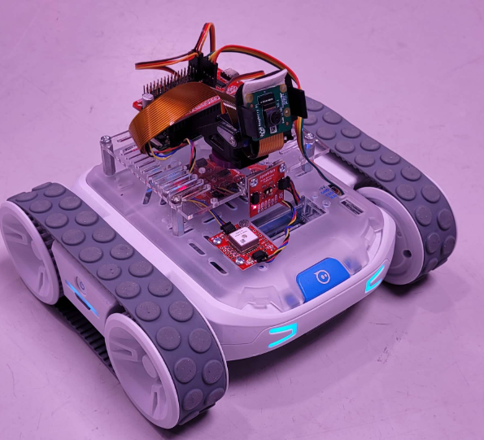

# AIS2203 - Sanntids datateknikk for kyberfysiske systemer Portfolio Project


This is a group project in the subject in AIS2203 - Sanntids datateknikk for kyberfysiske systemer.\
The project consist of creating software that enables communication from a PC using a Raspberry Pi and a Sphero RVR.


## PROJECT REQUIREMENTS
There had to be an established communication between the software on PC and the Sphero RVR and Raspberry PI.\
We were free to choose communication protocol and format.\
Both manual and autonomous control had to be implemented.\
It was also required to display runtime information about the Sphero RVR to the user.

## SOFTWARE
The project is written using mainly C++ and Python.

### C++:
The C++ program works by reading input from a user and sending commands to a Raspberry Pi using TCP.

Class descriptions:\
The CommandSender class is responsible for sending commands from the PC to the Raspberry Pi.\
Specifically, it is used in conjunction with RobotController to facilitate the RVR control via Raspberry Pi.

The RobotController class is responsible for controlling the RVR.\
It receives commands from the CommandSender class, sending commands to the RVR.

The SensorReceiver class is responsible for receiving sensor data from the Raspberry Pi.\
The data received is then displayed in the UI in the main function, and is updated once every second.

The FrameReceiver class is responsible for receiving frames from the Raspberry Pi.\
The frames are then displayed in the UI in the main function.

Main function:\
In the main function, the CommandSender, RobotController, SensorReceiver and FrameReceiver classes are initialized.\
The main function contains the UI, which is used to send commands to the RVR and display sensor data and frames.\
The UI is implemented by using cvui, and will present the user with a window containing buttons for manual and automatic mode,\
and displays the sensor data. 

The project uses multiple libraries such as: ```"boost-asio"```, ```"catch2"```, ```"opencv4"``` and ```"nlohmann-json"```.\
These libraries are automatically installed by the project by CMake using vcpkg.
To run the project it is required to provide a ```-DCMAKE_TOOLCHAIN_FILE``` configuration for vcpgk.

### Python:
The python code is responsible for the communication between the C++ program and the Sphero RVR and is contained in a single class called ```SpheroServer```

**Layout**
```SpheroServer``` starts 3 TCP servers on port 8000,8001,8002 that sends/receives data, each one running in its own thread. The videoserver does not sync with the other threads since its only job is to send camera images. Aditionaly there is a fourth thread running the robot controller which reads incomming commands and executes motorcontrol as well as lights.

**Video server**
```video_server()``` is the threadfunction that connects the websocket and executes the webcam function ```process_video_stream()```. This function then captures frames and sends a jpeg stream.

**Command server**
```command_server()``` is the threadfuntion that handles connection and runds the handle_client function.
```handle_client()``` takes in a json string and parses out the needed values to the SpheroServer class (see Command JSON format).

**Sensor server**
```sensor_server()``` same like the previous one it handles connection and runs ```sensor_updater()```. sensor_updater takes the ```self.sensor_data``` variable, turns it into JSON and ships it to c++ (see Sensor JSON format).

**Control robot**
```control_robot()``` Is a thread that reads the incomming data stored by handle_client and executes motorcontrol and LED colors. When in manual mode LED's are yellow, while auto is indicated by green. In case of bad commands it will light up purple.

**init sensors**
Beware that all sensordata gathering is done by the sphero library in the background and is declared in ```init_sensor_control()```. If a faster sensor poll speed is desired set ```self.rvr.sensor_control.start(interval=1000)``` to a lower interval (milliseconds). Each sensor gets called by ```self.rvr.sensor_control.add_sensor_data_handler(service,handler) ``` which calles each sensor handler function in the background.

**Ports used for communication**
8000 for webcam stream\
8001 for receiveing commands in JSON format\
8002 for sending sensordata in JSON format\
\
**Command JSON format** \
```Command : "string" ``` to set operating mode either MANUAL or AUTO\
```direction : "string"``` either F = forward, L = left, R = right, B = backwards, S = stop\
```speed : "float"``` floatvalue between 0 to 1 representing the % of max speed you wana go.\
```heading : "int"``` interger between -100 to 100. 0 means straight forward -100 full left 100 full right\
\
**Sensor JSON format**\
```battery : "int"``` send battery percentage as an interger\
```"ColorSensor" : "{"R": "int", "G": "int","B": "int"}``` RBG valued from the color sensor beneath the rvr.\
```"Accelerometer" : "{"X": "float", "Y": "float","Z": "float"} ``` XYZ accel values rounded down to 3 decimals.\
```"AmbientLight"`: "float"``` Float value of the onboard ambient light sensor.\
\
there is also a included discord script that sends the raspberry's ipv4 address to a webhook url if needed\
thanks to fhodun for his awesome repo https://github.com/fhodun/ip-webhook\
the script has been slightly modified to fit this project.\

## HARDWARE
**The hardware used in this project was:**
- Raspberry Pi zero W 
- sparkfun pi servohat https://www.sparkfun.com/products/15316
- raspberry pi camera module v2
- Sphero RVR.
- A plastic square ring was printed to avoid camera wobble while driving, look for file in CAD files

## INSTALLATION

### Sphero Pi
**update rasbian**
```
sudo apt update
sudo apt dist-upgrade
sudo apt clean
sudo reboot
```
\
**Install the sphero library**\
```python3 -m pip install sphero-sdk```\
\
**git clone the project repo onto the raspberry pi**\
```git clone https://github.com/Meelinank/sanntid.git```\
\
**Find the iphandover file and insert your discord webhook should you want it**\
```nano sanntid/Python/iphandover.py```\
\
**Run this command to update bootscript to run discord ip handler and python**\
```sudo cp sanntid/Python/rc.local /etc/rc.local```\
the rvr should now properly start on boot.


